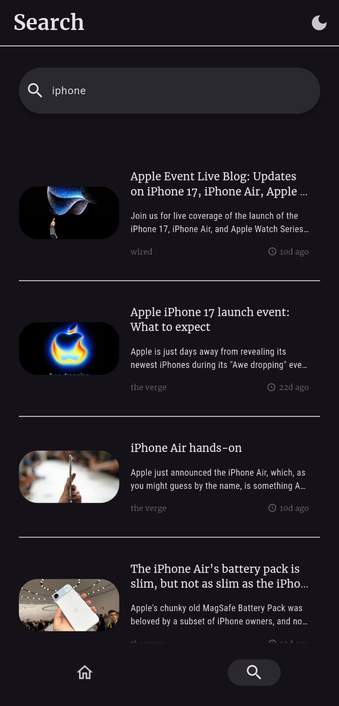

# Flutter News App

A simple Flutter News App that delivers the latest headlines and articles with a clean minimal UI.
The app fetches the latest news securely using **Supabase Edge Functions** as a proxy for NewsAPI and manages user login with Supabase Auth.

---

## Screenshots

<pre>

                               

</pre>

---

## Why Supabase?

Normally, NewsAPI requires an API key that would be visible in the Flutter client.  
To keep the key secure:

- the key stays hidden on the server, and the Flutter app only talks to Supabase.
- The Supabase function is deployed safely and runs publicly without exposing secrets.

This also made it possible to:

- **Add authentication** (login/register with Supabase Auth).
- Restrict some actions (like search) to logged-in users only.

---

## Features

### Core:

- Login page (navigates to app after login).
- Home page with latest news.
- Article detail page (full title, description, image, open in browser).
- Card-based layout for news.
- API integration with error handling.
- BLoC state management.

### Extras I Added:

- **Real authentication** with Supabase (not just dummy login).
- **Secure API key handling** via Supabase Functions.
- **Dark/Light theme** toggle.
- **Categories** (sports, tech, business, etc).
- **Search page** to filter articles by keywords.
- **Pull to refresh** on lists.
- **Fallbacks** for missing images or authors.
- **Date formatting** with 12h clock and readable format.
- **Responsive UI** using `flutter_screenutil`.
- **Minimal clean UI** for better user experience.

---

## Tech Stack

- **Flutter 3.24** & **Dart 3**

```yaml
# Ui / Design
cupertino_icons: ^1.0.8
lottie: ^3.3.2
flutter_screenutil: ^5.9.3
google_fonts: ^6.3.1

#State Mangment
flutter_bloc: ^9.1.1

# Networking / Backend
supabase_flutter: ^2.10.1
http: ^1.5.0

# Utilities
url_launcher: ^6.3.2
intl: ^0.20.2

# Build Tools
flutter_launcher_icons: ^0.14.4
```

---

## Project Structure

```
lib/
 ├── blocs/          # NewsBloc, ThemeCubit
 ├── model/          # Article model
 ├── services/       # SupabaseService (auth + news)
 ├── views/          # Pages (auth, home, search, category, details)
 ├── widgets/        # Reusable UI components
 └── main.dart
```

---

## Setup Instructions

1. Clone the repository

   ```bash
   git clone https://github.com/AbdelrahmanHamdyDev/news.git
   cd news
   ```

2. Install dependencies

   ```bash
   flutter pub get
   flutter pub run flutter_launcher_icons
   ```

3. Run the app with the defines

- On Linux / macOS:

  ```bash
  flutter build apk --release --dart-define=SUPABASE_URL=${{ your_SUPABASE_URL }} --dart-define=SUPABASE_ANON_KEY=${{ your_SUPABASE_ANON_KEY }} --dart-define=SUPABASE_FUNCTIONS_URL=${{ your_SUPABASE_FUNCTIONS_URL }}

  ```

- on Windows (PowerShell):
  ```bash
  flutter build apk --release --dart-define=SUPABASE_URL=your_SUPABASE_URL --dart-define=SUPABASE_ANON_KEY=your_SUPABASE_ANON_KEY --dart-define=SUPABASE_FUNCTIONS_URL=your_SUPABASE_FUNCTIONS_URL
  ```

---

## CI/CD & Versioning

- Current version: **v1.0.0**
- A **GitHub Actions workflow** builds the app on every push to make sure it compiles successfully, and Auto-release APK builds for easier testing.
